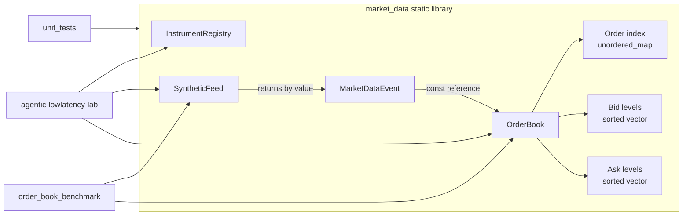

# Architecture

## Overview

This repository is a C++23 demonstration of an in-memory Level 3 market-data
processing path. A deterministic synthetic feed produces individual-order
events, and a single-instrument order book applies them while maintaining
price-level aggregates and FIFO order priority.

The CMake build creates a `market_data` static library and three executables:

- `agentic-lowlatency-lab` demonstrates the complete event flow.
- `unit_tests` verifies market-data, feed, order-book, and registry behavior.
- `order_book_benchmark` measures the latency and throughput of
  `OrderBook::apply()`.



## Main components

### Market-data event

`MarketDataEvent` is the value passed from a producer to the book. It contains:

- a nanosecond timestamp;
- an `OrderId`;
- an instrument ID;
- an integer price in ticks;
- a quantity;
- a `Buy` or `Sell` side;
- an `Add`, `Update`, or `Delete` action.

`OrderId` is an alias for `std::uint64_t`. Prices and quantities use integer
types, so processing does not require floating-point arithmetic. The event also
provides `to_str()` for demonstration and diagnostic output.

### Synthetic feed

`SyntheticFeed` owns a seeded `std::mt19937_64`, its random distributions, a
timestamp counter, a monotonically increasing next order ID, and a vector of
active synthetic orders. Supplying the same seed produces the same event
sequence.

The feed generates coherent order lifecycles:

- an add creates and records a new order ID;
- an update selects an active order and retains its ID, price, and side;
- a delete selects and removes an active order and emits quantity zero.

The active set is limited to 1,024 orders. When it is empty, the feed forces an
add. When it is full, an action initially selected as add becomes an update.
All events currently use instrument ID `1`.

### Order book

Each `OrderBook` instance belongs to one instrument. `apply()` first validates
the instrument and order ID, then dispatches to add, update, or remove logic.
It reports validation failures through `ApplyResult` and does not use
exceptions as normal event-processing results.

The book owns three principal containers:

- `_orders` is an `std::unordered_map<OrderId, OrderNode>` used for direct
  individual-order lookup.
- `_bids` is a vector of price levels sorted from highest to lowest price.
- `_asks` is a vector of price levels sorted from lowest to highest price.

An `OrderNode` stores price, quantity, side, a cached numeric level index, and
the previous and next order IDs at the same price. A `LevelState` stores
aggregate quantity, order count, and the first and last IDs in that FIFO chain.
Links use IDs rather than pointers, so movement of vector elements and rehashing
of the order index do not invalidate the links. The cached level index is a hint:
updates validate both its bounds and price before use, falling back to price
lookup and lazily repairing it after level insertion or erasure makes it stale.

The public `PriceLevel` and `OrderView` types are snapshots. They expose book
state without exposing internal nodes or iterators.

### Instrument registry

`InstrumentRegistry` owns two ordered maps: instrument name to ID and ID to
instrument name. Registration rejects duplicate names and duplicate IDs.
Name-based lookup accepts `std::string_view`; reverse lookup returns an optional
`std::string_view` into registry-owned storage.

### Demonstration executable

`main.cpp` registers `SYNTH` as instrument `1`, creates a feed and matching book,
generates 20 events, prints them, applies them, and reports accepted and rejected
counts. It is synchronous and single-threaded.

## Data flow

The demonstration and benchmark use the same core flow:

1. `SyntheticFeed::next()` updates the feed's active-order model and returns a
   `MarketDataEvent` by value.
2. The caller passes the event to `OrderBook::apply()` by const reference.
3. The book validates instrument ID, order ID, action-specific quantity, and
   existing order attributes.
4. An add creates an order node, locates or creates its price level, appends the
   ID to the level's FIFO chain, and updates the aggregate.
5. An update changes the individual and aggregate quantities without changing
   FIFO position.
6. A delete unlinks the order, adjusts the aggregate, erases the order node, and
   removes the price level if it becomes empty.
7. Callers may query aggregate levels, individual orders, order counts, FIFO
   head orders, or the best bid and ask.

Bid and ask level lookup uses `std::lower_bound`. Because each side is maintained
in best-to-worst order, the first vector element is the best level.

## Ownership and lifetime

The system uses direct value ownership and has no dynamic polymorphism or smart
pointers.

- `SyntheticFeed` exclusively owns its RNG, counters, distributions, and active
  synthetic-order vector.
- `OrderBook` exclusively owns its order index and both price-level vectors.
- `InstrumentRegistry` exclusively owns both mappings and their strings.
- A `MarketDataEvent` is owned by its caller after `next()` returns. The book
  only borrows it for the duration of `apply()` and retains no reference to it.
- `PriceLevel` and `OrderView` query results are returned by value and remain
  independent of subsequent book mutations.
- The `string_view` returned by `InstrumentRegistry::name_for()` refers to a
  registry-owned string and must not outlive the registry.

The components contain no locks. Their current lifetime and mutation model
assumes single-threaded access or synchronization supplied by the caller.

## Hot paths

The primary hot path is `OrderBook::apply()` and its action-specific operation.

Common work includes:

- instrument and order-ID validation;
- action dispatch;
- hash-table lookup by order ID;
- validated cached-level access or price-level lookup;
- aggregate quantity and FIFO-link maintenance.

Adds may allocate an order-index node. The constructor reserves the expected
number of orders, which defaults to 1,024, and reserves 64 levels on each side.
A new level can shift later vector elements. Updates validate the order's
cached numeric level index and avoid binary search while it still identifies
the expected price; a stale hint falls back to binary search and is repaired.
Updates mutate existing state without intentionally allocating. Deletes unlink
neighboring orders, erase a hash-table entry, and may shift levels when an
empty level is removed.

Best bid and best ask queries read the first element of their respective
vectors. Formatting through `MarketDataEvent::to_str()` and console output are
not part of the book's processing path.

## Testing architecture

`tests/test.cpp` contains GoogleTest tests for all current components. The test
executable links the `market_data` library with `GTest::gtest_main`. CMake uses
`gtest_discover_tests()`, so individual GoogleTest cases are registered with
CTest.

The suite covers:

- basic and deterministic synthetic-feed behavior;
- validity of generated add/update/delete lifecycles;
- event formatting;
- empty, bid, ask, add, update, and delete behavior;
- best prices and multiple price levels;
- invalid-event rejection without mutation;
- aggregation of several orders at one price;
- FIFO preservation and middle-order deletion;
- instrument registry lookup and duplicate rejection.

The feed lifecycle test applies 10,000 generated events to a real `OrderBook`
and expects every event to be accepted. Other order-book tests construct events
directly through a local helper to isolate specific state transitions.

Build and run the tests with:

```sh
cmake -S . -B build -DCMAKE_BUILD_TYPE=Release
cmake --build build -j
ctest --test-dir build --output-on-failure
```

## Benchmarking architecture

`benchmarks/order_book_benchmark.cpp` is a standalone executable linked to the
same `market_data` library as the demo and tests. It uses a fixed seed and a
fixed event count of 1,000,000.

Before timing, it generates all events into a vector whose capacity is reserved
up front. The measured loop:

1. reads an event from that vector;
2. records a `std::chrono::steady_clock` timestamp;
3. calls `OrderBook::apply()`;
4. records another timestamp;
5. stores the per-event nanosecond duration and counts successful applications.

A separate pair of timestamps surrounds the complete processing loop. That
duration is used for throughput and average nanoseconds per event. After the
loop, latency samples are sorted and used to report p50, p99, and p99.9.
Event generation, latency sorting, number formatting, and output are outside
the measured processing loop. The per-event clock calls and latency-array write
are inside the total-loop measurement.

Run the Release benchmark with:

```sh
cmake -S . -B build -DCMAKE_BUILD_TYPE=Release
cmake --build build -j
./build/order_book_benchmark
```
